# Programming Windows Phone 7.5 Part 1: Getting Started

## Introduction

Two weeks ago I wrote an article about using the [Stack Exchange API](https://github.com/geersch/StackExchangeAPI/). Turns out it got featured on [Channel 9](http://channel9.msdn.com/Shows/This+Week+On+Channel+9/TWC9-Oct-7-2011) last week. Cool.

In the video they wonder if there's such a thing as a [Stack Exchange application for the Windows Phone](http://www.windowsphone.com/en-US/search?q=stack+exchange). There a few available, but it got me thinking if I could easily port the code to run on my Windows Phone.

I myself, haven't developed much on the Windows Phone yet, apart from a few "Hello, World"-isch applications. Now that Mango (WP 7.5) has been officially released and I just reinstalled my PC, I figured this would be a good opportunity to get started with Windows Phone development.

## Mango Update

Maybe you haven't updated your Windows Phone yet because the Mango update is not available for your region and/or carrier? Well, there's a simple trick you can use to circumvent this. Who wants to wait weeks for new toys? Nobody! Just follow these steps:

1. Start Zune
2. Connect your phone to your PC
3. Have Zune check for an update for your phone
4. Disconnect your internet connection while Zune is checking for an update

First Zune will check if there is an update (Yes), and then it will perform a second check to see if you are permitted to install this update (region, carrier...etc. restrictions). Guess what happens if you disconnect from the internet between these two checks?

It may take a few tries, you have to be a bit lucky when you disconnect your internet connection. But if you hit the sweet spot, the second check will timeout and Zune will just report that there's an update. If so, just connect back to the internet and proceed with the update.

Voila, that's it. Worked for me on the first try (HTC Trophy). Be warned, updating your phone will take a long time. Get some coffee, sit back and relax.

## Windows Phone SDK 7.1

OK, we're running Mango now. Now let's make sure our development tools are also up to date. Open Chrome your favorite browser and navigate to [http://create.msdn.com/en-US/](http://create.msdn.com/en-US/). Next click on the "Download the free tools button". You can't miss it, it's really big.

[](http://create.msdn.com/en-us/home/getting_started)

On the following page you can download the [Windows Phone SDK 7.1](http://go.microsoft.com/?linkid=9772716) (Windows Phone 7.5/Mango = OS version 7.10.7720.68). The download (vm_web2.exe) is only 3 Mb. Once downloaded, start the setup and follow the wizard. Just click the big "Install Now" button.

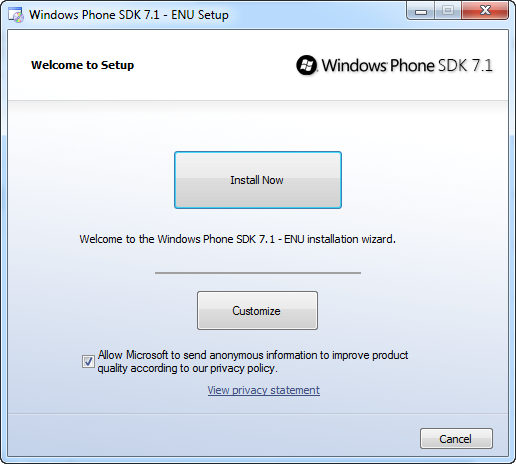

Big buttons, its a key ingredient of the WP experience.

The setup will download about +/- 530 Megabytes of installation files. If you have a good broadband connection, the entire setup will take about 10 minutes or so. Afterwards you can find the installed tools in the Start menu (Start > All Programs).

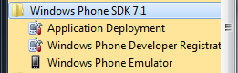

**Remark**: Make sure you have the [Visual Studio 2010 Service Pack 1](http://www.microsoft.com/download/en/details.aspx?id=23691) installed! You cannot install the Windows Phone SDK 7.1 without it!

## Hello, World!

We're ready to go. Let's create a "[Hello, World!](http://en.wikipedia.org/wiki/Hello_world_program)" application as a sort of a test drive. Start up Visual Studio 2010, create a new blank solution called WindowsPhone and add a new Windows Phone Application project titled HelloWorld to it.

You can find the Windows Phone Application project template in the "Silverlight for Windows Phone" folder (File > New Project).

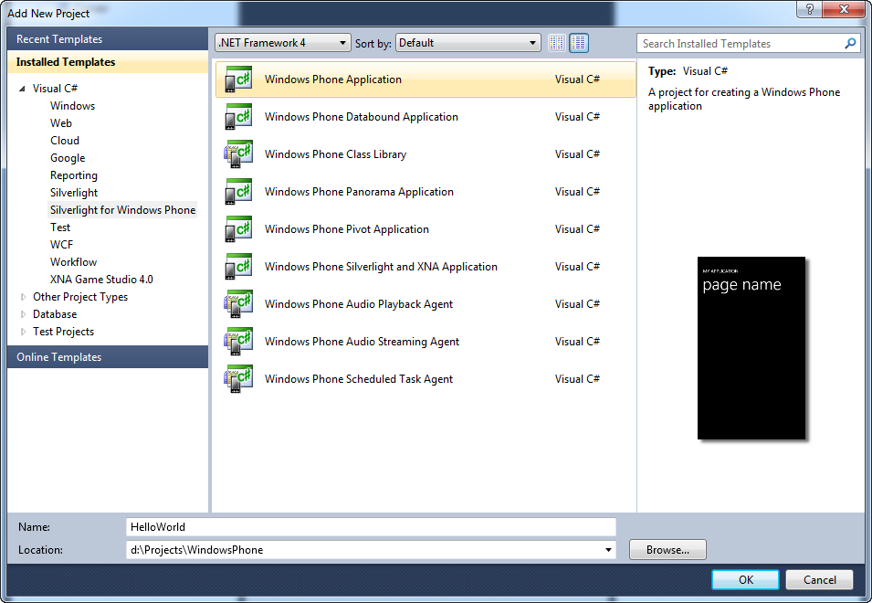

When creating the project Visual Studio will ask which SDK (7.0 or 7.1) you want to target.

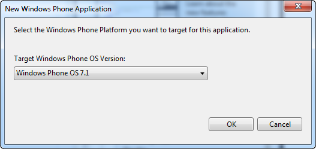

Select "Windows Phone OS 7.1" and click OK.

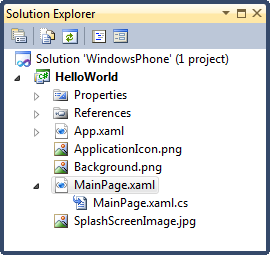

The default project template contains one Windows Phone page ([PhoneApplicationPage](<http://msdn.microsoft.com/en-us/library/ff402539(VS.92).aspx>)), called MainPage as you can see in the above screenshot.

You can compare it a bit to ASP.NET. It is composed out of two files, a XAML file (the layout) and a C# (.xaml.cs) file which contains the code behind. If you open the XAML file you'll get a split screen layout. One part shows the XAML while the other part shows the rendered layout.

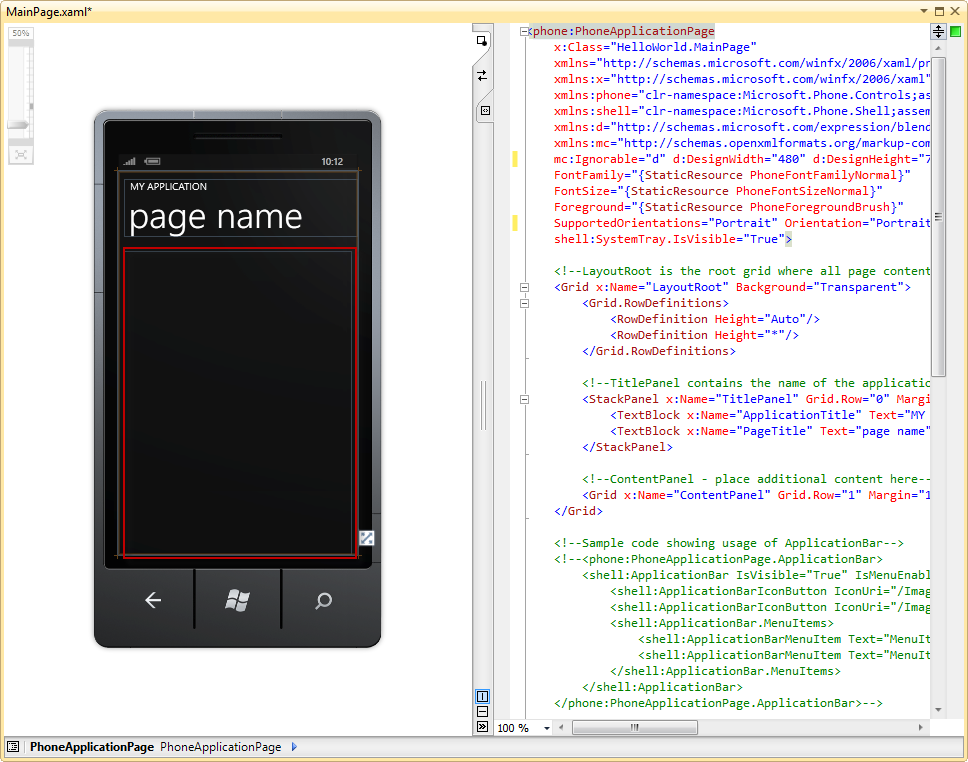

You can clearly see that the main page is divided into two sections. One section for the title and one for the body (marked with the red rectangle). Go to the toolbox and drag a [Button](<http://msdn.microsoft.com/en-us/library/hh487169(v=VS.92).aspx>) and a [TextBlock](<http://msdn.microsoft.com/en-us/library/hh202894(v=VS.92).aspx>) control to the body.

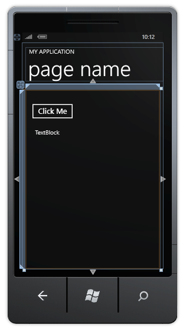

Give the controls some easy to remember names (e.g. MyButton, MyTextBlock).

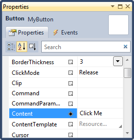

Double click on the button control to generate a click event handler in the code behind file. Add the following code to the event handler.

```csharp
private void MyButton_Click(object sender, RoutedEventArgs e)
{
    MyTextBlock.Text = "Hello, World!";
}
```

There, you just create your first Windows Phone application. Hit F5 to run the application. By default Visual Studio will start the Windows Phone emulator and deploy your application to it. Give it some time and your application will automatically start. Click on the button to change the TextBlock's text.

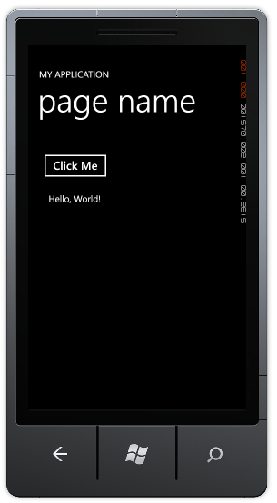

## \*Deploy To Device

The emulator runs the same software as your Windows Phone device. Of course it cannot mimic certain hardware specific features (compass, gps, accelerometer...etc.), but for development purposes its a handy tool. However, Visual Studio lets you choose to where you want to deploy your application. The emulator or an actual device.


So, start the Zune software, hook up your device and unlock the wallpaper. Next choose the option "Windows Phone Device" in Visual Studio and run your project.

The exception "Failed to connect to device as it is developer locked. For details on developer unlock, visit [http://go.microsoft.com/fwlink/?LinkId=195284](http://go.microsoft.com/fwlink/?LinkId=195284)." will now be thrown.

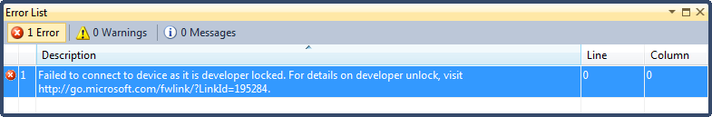

In order to deploy to an actual device you need to unlock it. You need to create an [App Hub account](http://create.msdn.com/en-us/home/membership). Unfortunately this costs 99$/year, but for this price you can unlock up to 3 devices and also deploy your application to the market place.

After you've created an App Hub account you need to use the "Phone Developer Registration" tool. You can find this in the folder into which the Windows Phone SDK was installed (C:\\Program Files\\Microsoft SDKs\\Windows Phone\\v7.1\\Tools\\Phone Registration).

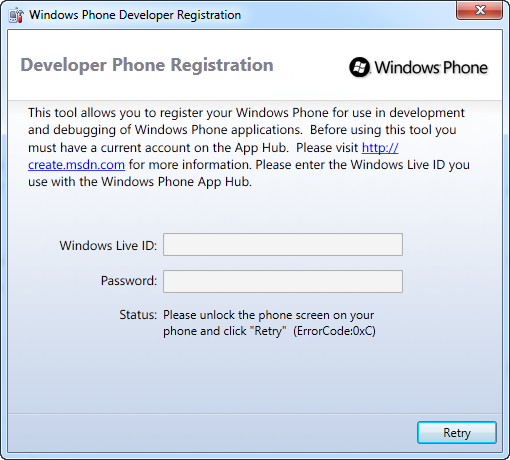

Afterwards you can deploy your applications to your device(s). This process does not actually modify anything on your device. It just registers in the cloud that it is now registered as a developer phone.

## Up next, part 2

During this series we are going to develop a small application which uses the Stack Exchange API to retrieve a user's [Stack Overflow profile](http://stackoverflow.com/users/893099/christophe-geers) (profile, badges and reputation). In the next part of this series, we'll create some icons which we can use to brand our application.

For example:


