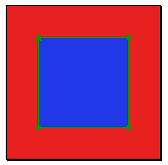

# Programming Windows Phone 7.5 Part 2: Icons

## Introduction

In the [previous part](http://cgeers.com/2011/10/16/programming-windows-phone-7-5-part-1-getting-started/) of this series I mentioned that the next one would be about creating some icons for your Windows Phone application.

Took me about two weeks to get around to it. Been busy, switched employers and am now working for a client in Brussels. Happened to lose my phone on the train last Friday or it was stolen. I was in a Zombie-like state (it was early), so I don't know. Remember putting it away, but when I did the 3 tap check \[wallet - keys - phone\] on the escalator it was gone ... and so was my train by that time. I guess I won't be deploying my apps any time soon.

Enough about me. Let's create some icons. For a Windows Phone application you'll need the following icons:

1. Application Icon (62 x 62)
2. Application Tile Image (173 x 173)
3. Marketplace catalog icon (small) (99 x 99)
4. Marketplate catalog icon (large) (173 x 173)
5. Desktop application icon (200 x 200)

Luckily we'll be using the PNG format for all of them. Let's get started.

## Preparation

Since we are creating a small StackOverflow application it seems fitting to use their icon.

Hrm, it's mostly gray and orange. That won't display so nicely if you choose a conflicting theme color. For instance, here's the icon with the Mango theme.

Urgh. Let's make life easy and choose a color that works well with most all themes. Microsoft seems to prefer white, so let's adjust our icon a bit. I used Photoshop CS2 for this purpose, but feel free to use any other graphics editing application. I just used what I know.

The easiest way in Photoshop, provided you have a good transparent image to work from is the following:

1. Start Photoshop
2. Open the image
3. Select everything and copy it to the clipboard
4. Create a new Photoshop file (make sure the background is transparent)
5. Paste
6. Double click the layer in the layers palette to select everthing in the layer
7. Press the 'd'-key to reset the fore -and background colors to black and white
8. Press CTRL+Backspace to fill the selection with white

Voila, you now have a nice white Stackoverflow icon.

(Displayed here with a black background for contrast purposes.)

Go ahead and save the image as a PNG file. Make sure the background is transparent.

## Base Layer

The Photoshop work is done. Time to move to another graphics editing application. Go ahead and download the 60-day trial of [Expression Studio 4](http://www.microsoft.com/expression/try-it/Default.aspx#PageTop) if you don't have it installed.

Once installed, start it up and create a new document (File > New...) of 1024 x 1024 pixels. Sure the icon is smaller, but we'll resize it later. It's just handier to work with this way.

Draw a rectangle anywhere on the surface.

Then select a color from the Properties window in order to fill the rectangle. It doesn't matter which color.

Now select the Selection tool (V) and resize the rectangle so that it fills the entire surface (1024 x 1024 pixels). Afterwards select the layer from the Layers palette and click the padlock icon to lock it. No more further modifications can be made to the layer while its locked.

Voila, you now have a 1024 x 1024 base layer. It's almost like painting IRL.

In my case I ended up with a big red square.

## Icon Placeholder

Create a new layer. Click the cogwheel symbol in the layers palette and choose the option "New Layer".

Draw a rectangle on the new layer and fill it with a color that contrasts well with the background layer. Once you've done this, you need to resize the rectangle (600 x 600) and center it.

Just select the rectangle and enter the following values in the transform options, which are displayed at the bottom of your screen.

First unlink the height and width (constrain ratio) by clicking upon the chain icon. Then set the W(idth) and H(eight) settings to 600. To center it set the X and Y-axis properties to 512.

Voila, you now have a placeholder in which you can put your icon. You should wind up with a design surface which looks like this (apart from the colors):

## The Icon

Time to put the actual icon in place. In Expression Design open (File > Open...) the file you created earlier with Photoshop (or your favorite graphical application). Once opened, select everything and copy the selection to the clipboard.

Close the file and go back to your icon design surface. Add a new layer and paste the icon. Now you need to resize and center it, just like you did with the icon placeholder.

- Unlink the width and height
- Set the width and height to 600
- Set the X and Y properties to 512

Your icon should now be neatly positioned within the icon placeholder.

## Slices

As mentioned before, you have to create 5 different icons. Let's reuse the same icon! Time to create a slice for every type of icon needed.

First you need to adjust the layer which serves as the icon's place holder. Set its opacity to 0%.

Now select the Selection tool (V) and drag a selection around the icon.

Time to create our first slice. Go to the Object menu and select the option "Create Slice from Selection".

In the properties window that is displayed give the slice an appropriate name (e.g. Application Tile Image) and set its resize properties (e.g. 173 x 173).

Repeat this and create a slice for each of the different icons that you need.

**Remark**: When you create your first slice a new layer will be created (Slice Layer). Before creating a new slice be sure to turn off the visibility of the slices or otherwise they will be included in the new slice. You can toggle the visibility by clicking on the eye icon next to the layer in the layers palette.

## Using The Icons

OK, you are almost there. Time to export your work so that you can use the icon in Visual Studio. Click "File > Export...". Select the slice you want to export and save them to a directory (e.g. the root of your project).

Once saved, go to Visual Studio and include the images in your Windows Phone project.

Then right-click on your project in the Solution Explorer, select properties and go to the Application tab. Here you can select which icon should be used for the application list and for the tile.

Voila, if you run your application now your custom icons will be displayed.

I learned this approach to creating Windows Phone icons from [an article by Rick Engle](http://expression.microsoft.com/en-us/gg317447). I customized it so it would fit my SO series, but you can find more information there. Certainly on how to create a better looking icon. But if you are creating an application for which icons are already available then this is a quick solution. Just create a white version of the icon and slice it up.

**Remark**: By default the title of the application is displayed on the application's tile. When creating that slice you might want to resize the icon a bit so that you'll a bit of room for the title to be displayed or it will be displayed across the icon.
