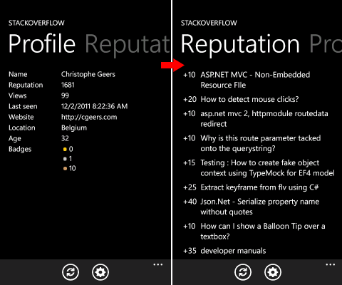
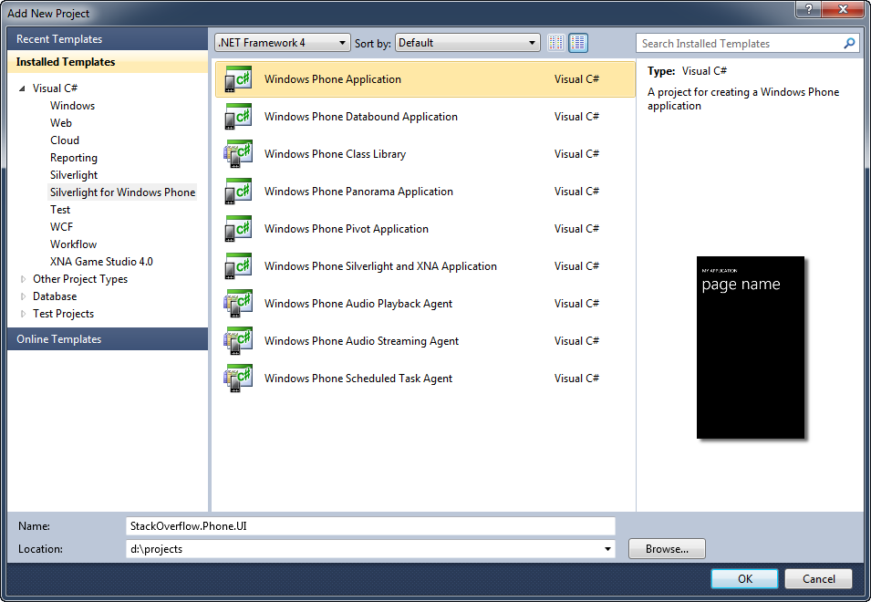
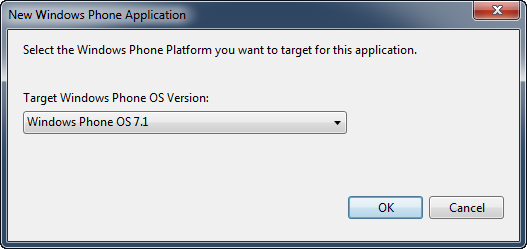
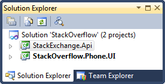
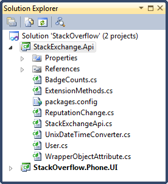
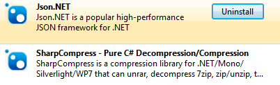

# Programming Windows Phone 7.5 Part 3: Stack Exchange API

## Introduction

Let's finish up the Windows Phone programming series I started in October. The first part "[Getting Started](../part-1/README.md)" guides you through the steps you need to follow in order to get up and running with Windows 7.5 (Mango) development. The [second part](../part-2/README.md) is a quick guide on how you can easily create your own icons to brand your application. Please read them first if you haven't done so yet.

It's about time we actually made the application do something useful. For this I choose to use the small wrapper for the [Stack Exchange API](https://github.com/geersch/StackExchangeAPI) I made some time ago. It would be nice if I had a small application which allows me to check my StackOverflow profile. Let's use this source code as the basis.

## The Application

Let's have a look at the application we are going to build. It's a simple application which only consists out of one page (MainPage.xaml). This page contains a [pivot control](<http://msdn.microsoft.com/en-us/library/ff941098(v=VS.92).aspx>) which is composed out of two pages, namely:

- **Profile page**: Shows your profile (name, reputation, badges...etc.)
- **Reputation page**: Lists your reputation updates for the last X days

A picture is worth a thousand words, so take a look at the following screenshots.



## The Solution

Let's start Visual Studio 2010 and create a new blank solution called StackOverflow. Next add a new project to it using the Windows Phone Application project template and call it StackOverflow.Phone.UI.



Make sure you target the Windows Phone 7.1 OS for all the projects in this solution. Visual Studio will ask this automatically when adding a new project.



Now you need to add a new Windows Phone Class Library named StackExchange.Api to the project. By now, your solution should resemble the following structure:



## Stack Exchange API

My small Stack Exchange API wrapper allows you to retrieve this data using just a few lines of code. We have to refactor it a bit to make it compatible with [Silverlight](http://www.microsoft.com/silverlight/) for Windows Phone before we can use it.

Download the [source code](https://github.com/geersch/StackExchangeAPI). Extract the archive and copy / paste the following files into the directory of the StackOverflow.Api class library.

- BadgeCount.cs
- ExtensionMethods.cs
- ReputationChange.cs
- StackExchangeApi.cs
- UnixDateTimeConverter.cs
- User.cs
- WrapperObjectAttribute.cs

Afterwards include these files in the StackOverflow.Api project.



Next you need to add the Json.NET and SharpCompress NuGet packages to this class library.



Download and install the [NuGet extension](http://nuget.org/) first if you don't have it already. You need the Json.NET package because the Stack Exchange API wrapper uses it to serialize / deserialize the data and the SharpCompress provides GZip support for Silverlight. There is no native GZip (GZipStream) support in Silverlight.

## Refactoring

If you build the StackOverflow.Api project the compiler will throw some errors. Let's fix them. By adding a reference to the SharpCompress assemblies you already fixed the missing GZipStream support. Just make sure you include the necessary namespaces in the StackExchangeApi.cs code file.

```csharp
using SharpCompress.Compressor;
using SharpCompress.Compressor.Deflate;
```

Also remove the reference to the System.IO.Compression namespace.

The major issue with the current implementation is that everything is done synchronously such as retrieval of a user's profile and his reputation changes. Silverlight requires you to do a lot things asynchronously. Retrieving a user's profile in the following manner will not work anymore:

```csharp
var api = new StackExchangeApi("your api key");
var user = api.GetUser(893099);
```

Let's fix it. Open the StackExchangeApi file and add the following delegate to the StackExchangeApi class.

```csharp
public delegate void StackExchangeApiCallback<T>(T data) where T : class, new();
```

Now change the signature of the GetUser(...) method as follows:

```csharp
public void GetUser(int userId, StackExchangeApiCallback<User> callback)
{
    GetStackExchangeObject(String.Format("/users/{0}", userId), callback);
}
```

When retrieving a user's profile you'll notice that we no longer expect the method to return a value. Instead we pass it a callback (our StackExchangeApiCallback delegate). This callback will be triggered when the user's profile has been retrieved. We won't wait for it anymore. We expect to be informed of this event.

The GetUser(...) method passes the callback to the refactored GetStackExchangeObject(...) method. Let's see how this method has been refactored to support asynchronous operations.

```csharp
private void GetStackExchangeObject<T>(string path, StackExchangeApiCallback<T> callback)
    where T : class, new()
{
    var requestUri = ComposeUri(path);
    GetSingleObject(requestUri, callback);
}

private void GetSingleObject<T>(string requestUri, StackExchangeApiCallback<T> callback)
    where T : class, new()
{
    var request = (HttpWebRequest) WebRequest.Create(requestUri);
    request.Method = "GET";
    request.Accept = "application/json";

    request.BeginGetResponse(
        ar =>
            {
                var response = (HttpWebResponse)request.EndGetResponse(ar);
                var json = ExtractJsonResponse(response);
                var data = ParseJson<T>(json).FirstOrDefault();
                callback(data);
            },
        null);
}
```

First the URL to the Stack Exchange resource is determined and then the GetSingleObject(...) method retrieves the data asynchronously. When the data arrives it is parsed and deserialized and our callback is triggered.

Last but not least remove or comment the private GetResponse(...) method. It is no longer needed.

You can now retrieve a user's profile in the following manner:

```csharp
private void UserRetrieved(User user)
{
    //...
}

var api = new StackExchangeApi("your api key");
var callback = new StackExchangeApi.StackExchangeApiCallback<User>(UserRetrieved);
api.GetUser(893099, callback);
```

When the user's profile has been retrieved the UserRetrieved(...) callback will be triggered. It retrieves an instance of the User type which contains the user's profile.

The same problem (sync Vs async) exists for retrieving a user's reputation changes, but the solution is similar to the fix for retrieving a profile. I won't list it here, just take a look at the source code accompanying this article. I also expanded the wrapper a little bit so that it returns a bit more data for the user's profile, reputation...etc. You can start from the old code and refactor it or you can just download the finished code. Here I just showed how you can refactor it. Just repeat it for the reputation updates and it's done.

## User Interface

I'm not going to focus much on the actual user interface. As you can see in the screenshots above it's a very simple interface. One page containing a pivot control which has two pages. One to display the user's profile and another one to list his reputation updates.

The profile page contains a grid which lists the user's name, reputation, views, age, badge count...etc. The reputation page contains a ListBox which lists the user's reputation updates. Download the source and take a look at the XAML code if you want to explore it, but's its really basic.

The application also contains an [ApplicationBar](<http://msdn.microsoft.com/en-us/library/ff431801(v=vs.92).aspx>) which contains two icons. A refresh icon and a settings icon. I did not implement a settings page, I'll leave that to you as an exercise. It's just meant to be a simple settings page where you can enter your Stack Overflow user id. The sample code uses a hardcoded id. Feel free to improve on that and implement a settings page.


The code for the application is pretty simple. Just add a reference to the StackOverflow.Api library from the UI project. Just create an instance of the StackExchangeApi class.

```csharp
public partial class MainPage : PhoneApplicationPage
{
    private StackExchangeApi _api;

    // Constructor
    public MainPage()
    {
        InitializeComponent();

        this._api = new StackExchangeApi("your api key");

        Loaded += MainPage_Loaded;
    }

    //...
}
```

Afterwards it's really simple to load the data. Just create a callback and call the GetUser(...) method.

```csharp
void MainPage_Loaded(object sender, System.Windows.RoutedEventArgs e)
{
    var callback = new StackExchangeApi.StackExchangeApiCallback<User>(UserRetrieved);
    this._api.GetUser(893099, callback);

}

void UserRetrieved(User user)
{
    Dispatcher.BeginInvoke(() =>
    {
        DisplayName.Text = user.DisplayName;
        // ...
        BronzeBadges.Text = user.BadgeCounts.Bronze.ToString();
    });
}
```

Just make sure to access the controls on the UI thread, hence the Dispatcher.BeginInvoke(...) call.

That's about all it takes to quickly create a sample Windows Phone demo application using the Stack Exchange API. If you want more information on how this API was used please read the [Stack Exchange API](https://github.com/geersch/StackExchangeAPI) article which I wrote a couple of months ago.
